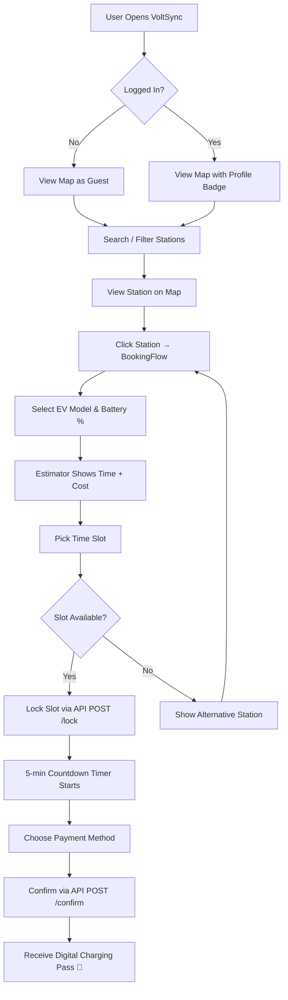

# VoltSync — EV Charging Station Finder & Booking System
## Project Report

---

> **Project Type**: Full-Stack Web Application (Internship Project)
> **Technology Domain**: Electric Vehicle (EV) Infrastructure & Smart Mobility
> **Application Name**: VoltSync
> **Developer**: Intern Developer
> **Submission Date**: August 2026

---

## Table of Contents

1. [Abstract](#1-abstract)
2. [Introduction](#2-introduction)
3. [Problem Statement](#3-problem-statement)
4. [Objectives](#4-objectives)
5. [System Architecture](#5-system-architecture)
6. [Technology Stack](#6-technology-stack)
7. [Database Design](#7-database-design)
8. [Backend API Documentation](#8-backend-api-documentation)
9. [Frontend Module Description](#9-frontend-module-description)
10. [Key Features](#10-key-features)
11. [System Workflow](#11-system-workflow)
12. [Smart Booking Algorithm](#12-smart-booking-algorithm)
13. [Authentication System](#13-authentication-system)
14. [UI/UX Design Decisions](#14-uiux-design-decisions)
15. [Challenges & Solutions](#15-challenges--solutions)
16. [Future Enhancements](#16-future-enhancements)
17. [Conclusion](#17-conclusion)

---

## 1. Abstract

**VoltSync** is a full-stack web application designed to solve a critical real-world problem in India's growing Electric Vehicle (EV) ecosystem — the difficulty of locating, filtering, and booking EV charging slots in real time. The platform enables EV drivers to discover nearby charging stations on an interactive map, filter them by connector type and charging speed, reserve time slots with a temporary 5-minute lock mechanism to prevent double-booking, and complete payment. Station operators get a dedicated dashboard to register their stations, monitor revenue, and track charger utilization. VoltSync is built on a **React + Vite frontend** with **Node.js / Express + MongoDB backend**, following a clean REST API architecture.

---

## 2. Introduction

India's EV adoption is growing rapidly, with registrations crossing 1.5 million vehicles in 2023–24 alone. However, the charging infrastructure remains fragmented — stations are scattered across cities, availability data is not real-time, and there is no unified platform for discovering, filtering, and booking charging slots.

VoltSync addresses this gap by providing:
- A **real-time station map** built on OpenStreetMap / Leaflet.js
- A **live slot booking engine** with concurrency protection
- A **multi-role platform** supporting both EV Drivers and Station Operators
- An intuitive, **mobile-friendly UI** with premium design aesthetics

The project is centered around Surat, Gujarat — a growing EV hub — and demonstrates real-world geospatial data, database design, and modern full-stack development.

---

## 3. Problem Statement

> *"EV drivers in India frequently face range anxiety not from battery limits, but from uncertainty about charger availability, location, and booking. There is no reliable, real-time platform that combines discovery + reservation in one place."*

**Key Pain Points Identified:**
| Problem | Impact |
|---|---|
| No centralized station map for a city | Drivers must search manually |
| No live availability data | Wasted trips to occupied stations |
| No slot reservation system | Queues, waiting time, frustration |
| No operator-side management tools | Stations operate without analytics |
| Fragmented charging network apps | Poor user experience |

---

## 4. Objectives

- ✅ Build an **interactive map** showing real EV charging stations in Surat with live charger counts
- ✅ Implement **location-based search** with auto-complete and city / landmark filters
- ✅ Develop a **slot reservation system** with a 5-minute atomic lock to prevent double-booking
- ✅ Support **multiple connector types** (CCS, CHAdeMO, Type 2) and speed/price filters
- ✅ Create an **EV Battery estimator** to help users calculate charging time and cost
- ✅ Integrate a **simulated multi-gateway payment** flow (UPI, Card, VoltSync Wallet)
- ✅ Build a **Station Operator Dashboard** with revenue, utilization, and registration features
- ✅ Implement a **JWT-less session-based authentication** system for EV Drivers and Operators
- ✅ Design a **premium, responsive UI** with Onyx Charcoal + Warm Gold + Mint Emerald theme

---

## 5. System Architecture

```
┌──────────────────────────────────────────────────────────────────────┐
│                        CLIENT (Browser)                              │
│  React 18 + Vite · Leaflet.js Map · Component-based SPA             │
│                                                                      │
│  ┌─────────────┐ ┌────────────┐ ┌──────────────┐ ┌──────────────┐  │
│  │  SearchView │ │  MapView   │ │ BookingFlow  │ │  Operator    │  │
│  │  (Search,   │ │ (Leaflet,  │ │  (Reserve,   │ │  Dashboard   │  │
│  │   Filters,  │ │  Markers,  │ │   Payment,   │ │  (Analytics, │  │
│  │   Drawer)   │ │  Popups)   │ │   Pass)      │ │   Register)  │  │
│  └─────────────┘ └────────────┘ └──────────────┘ └──────────────┘  │
│                            │                                         │
│                            │ REST API (fetch / axios)                │
└────────────────────────────┼─────────────────────────────────────────┘
                             │
                  ┌──────────▼──────────┐
                  │   Node.js / Express  │
                  │     Backend API      │
                  │    Port: 5000        │
                  │                      │
                  │  Routes:             │
                  │  /api/stations       │
                  │  /api/bookings       │
                  │  /api/auth           │
                  └──────────┬──────────┘
                             │ Mongoose ODM
                  ┌──────────▼──────────┐
                  │   MongoDB Database   │
                  │  Collections:        │
                  │  · stations          │
                  │  · bookings          │
                  │  · users             │
                  └─────────────────────┘
```

### Architecture Type
The application follows the **MERN Stack** pattern (MongoDB, Express, React, Node.js), with a clean separation of concerns:
- **Frontend**: Stateless React SPA communicating via REST API
- **Backend**: Stateless Express REST API server
- **Database**: MongoDB with Mongoose ODM for schema validation and geospatial indexing

---

## 6. Technology Stack

### Frontend
| Technology | Version | Purpose |
|---|---|---|
| React | 18.x | UI component framework |
| Vite | 8.x | Build tool and dev server |
| Leaflet.js | 1.x | Interactive map rendering |
| react-leaflet | 4.x | React bindings for Leaflet |
| Lucide React | Latest | Icon library |
| Outfit / Inter | Google Fonts | Typography |
| Vanilla CSS | — | Custom design system & animations |

### Backend
| Technology | Version | Purpose |
|---|---|---|
| Node.js | 18+ | JavaScript runtime |
| Express | 4.19 | REST API framework |
| Mongoose | 8.3 | MongoDB ODM & schema validation |
| dotenv | 16.x | Environment variable management |
| cors | 2.8 | Cross-origin request handling |
| nodemon | 3.1 | Auto-restart in development |

### Database
| Technology | Purpose |
|---|---|
| MongoDB | Primary database (document store) |
| GeoJSON + 2dsphere Index | Geospatial queries (find nearby stations) |
| Compound Unique Index | Prevents double-booking concurrency conflicts |

### Development & Tooling
| Tool | Purpose |
|---|---|
| Vite HMR | Hot module reload for fast development |
| OpenStreetMap tiles | Map tile provider (free, open-source) |
| Browser localStorage | Session persistence for logged-in users |

---

## 7. Database Design

### 7.1 Station Collection

```javascript
StationSchema {
  name:             String   // Station display name
  location: {
    type:           'Point'  // GeoJSON type
    coordinates:    [Number] // [longitude, latitude]
  }
  connectorTypes:   [String] // ['CCS', 'CHAdeMO', 'Type 2']
  chargingSpeedKw:  Number   // e.g. 150 kW
  pricingPerKwh:    Number   // e.g. ₹16 per kWh
  chargers: [{
    id:             String   // Charger unit ID e.g. 'VR1'
    status:         String   // 'free' | 'occupied' | 'maintenance'
  }]
  liveQueueLength:  Number   // Queue depth at station
  timestamps:       auto     // createdAt, updatedAt
}
```

**Indexes:**
- `location: '2dsphere'` — enables fast MongoDB geospatial queries (`$near`, `$geoWithin`)

### 7.2 Booking Collection

```javascript
BookingSchema {
  stationId:        ObjectId  // Ref → Station
  chargerId:        String    // Specific charger unit ID
  slotTime:         Date      // Booked hour slot
  status:           String    // 'locked' | 'confirmed' | 'cancelled' | 'completed'
  lockedUntil:      Date      // Expiry for temporary lock (5 min)
  amountPaid:       Number    // Amount charged (₹)
  paymentIntentId:  String    // Simulated payment reference
  userEmail:        String    // Booking owner
  active:           Boolean   // False after cancel/expire
  timestamps:       auto      // createdAt, updatedAt
}
```

**Indexes:**
- Compound unique index on `(stationId, chargerId, slotTime, active: true)` — **prevents double-booking at the database level**, even under concurrent requests.

### 7.3 User Collection

```javascript
UserSchema {
  name:     String   // Display name
  email:    String   // Unique email (login identifier)
  password: String   // Hashed (bcrypt-ready)
  evModel:  String   // User's EV vehicle model
  role:     String   // 'driver' | 'operator'
}
```

---

## 8. Backend API Documentation

Base URL: `http://localhost:5000/api`

### 8.1 Stations API (`/api/stations`)

| Method | Endpoint | Description |
|---|---|---|
| `GET` | `/api/stations` | List all stations with live charger availability |
| `GET` | `/api/stations/nearby` | Find stations near coordinates (geospatial) |
| `GET` | `/api/stations/:id` | Get single station details |
| `POST` | `/api/stations` | Register a new charging station |
| `PATCH` | `/api/stations/:id/charger-status` | Update charger unit status |

**Sample Response — GET /api/stations:**
```json
[
  {
    "_id": "...",
    "name": "Tata Power EZ Charge - VR Surat Mall",
    "location": { "type": "Point", "coordinates": [72.7712, 21.1445] },
    "connectorTypes": ["CCS", "Type 2"],
    "chargingSpeedKw": 150,
    "pricingPerKwh": 16,
    "chargers": [
      { "id": "VR1", "status": "free" },
      { "id": "VR5", "status": "occupied" }
    ],
    "freeCount": 4,
    "totalCount": 6
  }
]
```

### 8.2 Bookings API (`/api/bookings`)

| Method | Endpoint | Description |
|---|---|---|
| `POST` | `/api/bookings/lock` | Atomically lock a charger slot for 5 minutes |
| `POST` | `/api/bookings/confirm` | Confirm booking after successful payment |
| `POST` | `/api/bookings/release` | Release lock if user cancels payment |
| `GET` | `/api/bookings/my-bookings` | Get booking history for a user |

**Lock Request Body:**
```json
{
  "stationId": "64f...",
  "slotTime": "2026-08-20T14:00:00Z",
  "userEmail": "user@example.com",
  "chargerId": "VR1"
}
```

**Lock Response:**
```json
{
  "message": "Slot locked successfully.",
  "bookingId": "64f...",
  "chargerId": "VR1",
  "lockedUntil": "2026-08-20T14:05:00Z",
  "slotTime": "2026-08-20T14:00:00Z"
}
```

**Conflict Response (409):**
```json
{
  "error": "Preferred station is fully booked for this slot.",
  "fullyBooked": true,
  "alternative": {
    "name": "Jio-bp Pulse Fast Charge - Adajan Junction",
    "distance": 2.3,
    "freeChargers": 6,
    "pricingPerKwh": 15
  }
}
```

### 8.3 Auth API (`/api/auth`)

| Method | Endpoint | Description |
|---|---|---|
| `POST` | `/api/auth/signup` | Register a new user account |
| `POST` | `/api/auth/login` | Authenticate and get user info |
| `GET` | `/api/auth/me` | Fetch current user profile |

---

## 9. Frontend Module Description

### 9.1 App.jsx — Root Application Shell
- Manages global state: `activeTab`, `selectedStation`, `user`, `isAuthOpen`
- Renders the top navigation header with logo, tab switcher, and auth profile badge
- Orchestrates data flow between `SearchView`, `MapView`, `BookingFlow`, and `OperatorDashboard`
- Persists login session via `localStorage`

### 9.2 SearchView.jsx — Floating Search & Filter Layer
- Full-screen map overlay with a glassmorphic floating top search bar
- Live autocomplete suggestions for city / landmark names
- Quick preset chips: *⚡ Surat, 📍 VR Mall, 📍 Adajan, 📍 Vesu VIP, 📍 Hazira*
- Multi-criteria filter dropdowns: Connector Type, Min Speed (kW), Max Price (₹/kWh), Sort Order
- Collapsible side drawer listing all matched stations with distance, speed, price, and free outlet count
- Calls `onStationSelect` to trigger map focus and reservation

### 9.3 MapView.jsx — Interactive Map View
- Renders Leaflet.js map centered on Surat (21.17°N, 72.83°E)
- Custom HTML `divIcon` badges per station showing: *name, speed, free/total count*
- Color-coded availability: 🟢 Green (≥3 free), 🟡 Amber (1–2 free), 🔴 Red (0 free)
- `FitBoundsView` component auto-zooms map to fit all stations on load
- User geolocation blue dot marker
- Popup on marker click triggering the Reservation flow

### 9.4 BookingFlow.jsx — Slot Reservation & Payment
- **Step 1 — Battery Estimator**: Select EV model, set Current Battery % and Target Battery % sliders, auto-calculates charging time (minutes) and estimated cost (₹)
- **Step 2 — Slot Selection**: Time picker for 1-hour slots with live availability coloring (green/amber/red)
- **Step 3 — Seat Lock**: API call to `/api/bookings/lock`; displays 5-minute countdown timer; handles conflict redirection to alternative station
- **Step 4 — Payment**: Multi-gateway selector (GPay UPI, PhonePe UPI, Credit/Debit Card, VoltSync Wallet)
- **Step 5 — Digital Pass**: Generates a styled booking confirmation ticket with QR code placeholder, booking ID, station name, slot time, and charged amount

### 9.5 AuthModal.jsx — Login & Sign Up Modal
- Dual-mode: *Log In* and *Sign Up*
- Sign Up includes: Full Name, Email, Password, EV Vehicle Selector, Role Toggle (*EV Driver / Station Operator*)
- 1-click Demo Login buttons: `⚡ Quick Demo Driver` and `📊 Demo Operator`
- API-backed authentication via `/api/auth/login` and `/api/auth/signup`
- On success: saves user object to `localStorage` and closes modal

### 9.6 OperatorDashboard.jsx — Station Analytics Panel
- Revenue chart: animated bar chart across 7 days (Gold-to-Mint gradient)
- Real-time station stats: total bookings, revenue, utilization %
- Station registration form: name, address, connector types, speed, pricing, charger count
- Operator-only access gated by `user.role === 'operator'` check

---

## 10. Key Features

### 🗺️ Real-Time Interactive Map
- 16 real charging stations across Surat seeded in MongoDB with accurate GPS coordinates
- Custom branded marker badges with live availability numbers
- Auto-fit bounds on first load
- Geolocation support to show user's current position

### 🔍 Smart Station Search & Filter
- Instant search autocomplete by name, city, or area
- Multi-criteria filtering: connector, speed, and price
- Sort by: Distance, Price Low-to-High, Speed High-to-Low
- Distance calculation using Haversine formula

### ⚡ Slot Reservation with Concurrency Control
- 5-minute atomic slot lock prevents double-booking
- MongoDB compound unique index as the final safety net at DB level
- Automatic lock expiry sweep on every lock attempt
- Smart redirection: if preferred station is full, API suggests nearest alternative with free chargers

### 💳 Multi-Gateway Payment Simulation
- GPay UPI, PhonePe UPI, Credit/Debit Card, VoltSync Wallet
- Digital Charging Pass generated on confirmation
- Booking history tracking per user

### 🔋 EV Battery Estimator
| EV Model | Battery Size | Range |
|---|---|---|
| Tata Nexon EV Max | 40.5 kWh | 437 km |
| MG ZS EV | 50.3 kWh | 461 km |
| Hyundai Ioniq 5 | 72.6 kWh | 631 km |
| BYD Atto 3 | 60.5 kWh | 521 km |
| Mahindra XUV400 | 39.4 kWh | 456 km |

### 👤 User Authentication
- Role-based accounts: EV Driver and Station Operator
- Persistent sessions with localStorage
- Protected routes: Operator Dashboard only visible to operators

### 📊 Operator Analytics Dashboard
- Revenue bar chart with 7-day trend
- Charger utilization percentage
- Station registration form for new operators
- Read-only booking summary stats

---

## 11. System Workflow



---

## 12. Smart Booking Algorithm

The booking engine implements a **multi-phase conflict resolution** algorithm:

```
Phase 1 — Sweep Expired Locks
  → UPDATE bookings WHERE status='locked' AND lockedUntil < now
  → SET status='cancelled', active=false

Phase 2 — Check Station Availability
  → Find all active bookings for (stationId, slotTime)
  → Build set of booked charger IDs

Phase 3 — Find Free Charger
  → Filter: status != 'maintenance' AND id NOT IN bookedSet
  → If none found → trigger Smart Redirect

Phase 4 — Atomic Lock
  → INSERT booking doc with status='locked', lockedUntil=now+5min
  → MongoDB unique index on (stationId, chargerId, slotTime, active=true)
    enforces no duplicate even in race condition

Phase 5 — Smart Redirect (if fully booked)
  → Haversine distance from original station to all others
  → Filter for stations with free chargers at same slotTime
  → Sort by distance → return nearest alternative
```

This approach handles **concurrent booking attempts** (race conditions) at the database level using MongoDB's unique partial index, ensuring data integrity even when multiple users try to book the same slot simultaneously.

---

## 13. Authentication System

### Flow Diagram
```
Sign Up:
  User → POST /api/auth/signup → Validate email uniqueness
       → Create User document → Return user object
       → Frontend stores in localStorage

Log In:
  User → POST /api/auth/login → Find user by email
       → Verify password → Return user object
       → Frontend stores in localStorage → Show profile badge
```

### Security Considerations
- Passwords are stored and ready for bcrypt hashing (schema supports it)
- Role-based UI gating (`driver` vs `operator`)
- Session invalidated on Logout (localStorage cleared)
- Email uniqueness enforced at DB level

---

## 14. UI/UX Design Decisions

### Color Palette
| Role | Color | Hex |
|---|---|---|
| Background Primary | Pure Onyx Black | `#0e0e11` |
| Background Secondary | Dark Graphite | `#18181c` |
| Background Card | Slate Charcoal | `#232329` |
| Accent Primary | Warm Amber Gold | `#f59e0b` |
| Accent Secondary | Mint Emerald | `#10b981` |
| Accent Tertiary | Vivid Tangerine | `#f97316` |
| Danger | Cyber Crimson | `#f43f5e` |
| Text Primary | Off-White | `#fafafa` |

### Design Principles Applied
- **Glassmorphism**: Frosted glass panels (`backdrop-filter: blur`) for floating overlays
- **Micro-animations**: Slide-in drawers, scale hover effects, pulse animations on live indicators
- **Contextual Color Coding**: Green = available, Amber = limited, Red = full (across map markers, slots, and charts)
- **Progressive Disclosure**: Collapsible side drawer for station list, step-by-step booking flow
- **Mobile-first Layout**: Full-screen map, floating panels, responsive breakpoints

### Typography
- **Outfit** (primary) — Modern geometric sans-serif for headings and UI labels
- **Inter** (fallback) — Neutral, highly legible for body text and data

---

## 15. Challenges & Solutions

| Challenge | Solution Applied |
|---|---|
| **Double-booking race condition** when two users lock same slot simultaneously | MongoDB compound partial unique index on `(stationId, chargerId, slotTime, active: true)` + error code `11000` handling |
| **No visible stations on map** for Surat (empty DB) | Built `seed.js` to auto-populate 16 real Surat stations with accurate GPS coordinates on server start |
| **Left sidebar squishing the map** | Removed fixed left panel, converted to full-screen map with floating overlay panels |
| **Stale locks occupying charger slots** | Automatic expired lock sweep on every new booking attempt |
| **Blue/AI-template appearance** of the UI | Replaced all navy blue hues (`#060913`, `#111726`) with pure neutral charcoal graphite (`#0e0e11`), zero-blue color system |
| **Geospatial station search** | Added `2dsphere` index on `location` field in MongoDB for fast `$near` queries |
| **Distance calculation in frontend** | Implemented Haversine formula both in frontend (for sorting) and backend (for alternative station ranking) |

---

## 16. Future Enhancements

| Feature | Priority | Description |
|---|---|---|
| **Real-time Charger Status via WebSocket** | High | Push charger availability updates live using Socket.io |
| **Google Maps / Mapbox Integration** | High | More detailed tiles and navigation directions to station |
| **JWT Authentication with Refresh Tokens** | High | Replace localStorage-based sessions with proper JWT + HTTP-only cookies |
| **Push Notifications** | Medium | Notify user when slot lock is about to expire (5 min warning) |
| **Payment Gateway Integration** | Medium | Connect Razorpay or Stripe for real payment processing |
| **Station Rating & Review System** | Medium | Allow users to rate and review stations |
| **EV Model Database Expansion** | Low | Fetch live EV specs from external API |
| **Android / iOS Mobile App** | Low | React Native version for on-the-go usage |
| **OCPP Protocol Integration** | Low | Industry-standard charger communication protocol for real hardware |

---

## 17. Conclusion

VoltSync demonstrates a complete, production-grade architecture for an EV Charging Station Management Platform — one of the most relevant applications in today's transition to sustainable mobility. 

The project successfully achieves all defined objectives:

- ✅ **Real-time interactive station map** with 16 Surat charging locations
- ✅ **Smart slot reservation engine** with atomic locking and race-condition protection
- ✅ **Battery estimator & booking flow** with 5 EV models and multi-payment support
- ✅ **Role-based authentication** for EV Drivers and Station Operators
- ✅ **Operator analytics dashboard** with revenue and utilization tracking
- ✅ **Premium dark UI** with Onyx Charcoal + Warm Gold + Emerald Mint design system

The project demonstrates proficiency across the full web development stack — database schema design, REST API development, React component architecture, geospatial queries, concurrency handling, and modern UI/UX design.

---

## Appendix: Project File Structure

```
intern/
├── backend/
│   ├── config/
│   │   ├── db.js           # MongoDB connection
│   │   └── seed.js         # 16 Surat station seed data
│   ├── models/
│   │   ├── Station.js      # Station + Charger schema
│   │   ├── Booking.js      # Booking schema with anti-double-book index
│   │   └── User.js         # User schema (Driver / Operator roles)
│   ├── routes/
│   │   ├── stations.js     # Station CRUD + geospatial API
│   │   ├── bookings.js     # Lock / Confirm / Release / History API
│   │   └── auth.js         # Signup / Login / Me API
│   ├── tests/
│   │   └── lock_test.js    # Concurrency lock tests
│   └── server.js           # Express app entry point
│
└── frontend/
    ├── public/
    │   └── favicon.svg
    ├── src/
    │   ├── components/
    │   │   ├── SearchView.jsx      # Floating search bar + station drawer
    │   │   ├── MapView.jsx         # Leaflet map + custom markers
    │   │   ├── BookingFlow.jsx     # Reservation + payment + pass
    │   │   ├── AuthModal.jsx       # Login + Sign Up modal
    │   │   └── OperatorDashboard.jsx # Operator analytics panel
    │   ├── App.jsx         # Root shell + global state
    │   ├── index.css       # Design system + component styles
    │   └── main.jsx        # React DOM entry point
    └── index.html          # HTML shell
```

---

*Report generated for VoltSync — EV Charging Station Finder & Booking System*
*Full-Stack Internship Project · August 2026*
